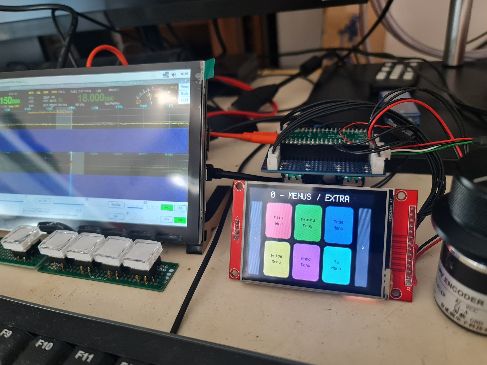

# Radioberry VFO Deck

The **Radioberry VFO Deck** is a dedicated auxiliary display for tuning and controlling Radioberry-based SDR radios, using a **Raspberry Pi Pico** microcontroller with display, encoders, and physical buttons.

  

Communication with the radio software is done via **USB MIDI**, allowing control and status visualization in **piHPSDR**, **DeskHPSDR**, and other compatible software, with integration through **TCI → MIDI**.

---

## Objective

- Provide a dedicated physical interface for tuning (VFO)
- Display the current frequency prominently
- Expand Radioberry control buttons through multiple screens with virtual button groups
- Control radio functions using encoders and physical buttons
- Reduce dependency on mouse and keyboard
- Operate independently and complementarily with the main graphical interface

---

## General Architecture

Radioberry
↑
piHPSDR / DeskHPSDR (TCI)
↑
Bridge on PC (TCI → MIDI)
↑
Raspberry Pi Pico (USB MIDI)
↑
Display + Encoders + Buttons

- Radio status is obtained via **TCI**
- The Pico does not access TCI directly
- A bridge on the PC converts TCI events into MIDI messages

---

## Screen 0 – Tuning

The main system screen is dedicated to tuning.

### Displayed Information
- Current frequency (Hz)
- Active VFO (A / B)
- Operating mode
- Tuning STEP
- RIT / XIT
- TX / RX status
- Lock and split indicators
- (Optional) signal level

### On-Screen Controls
- BAND − / BAND +
- MODE
- FILTER
- AGC
- RIT / XIT
- SPLIT
- A/B
- LOCK
- MENU

---

## Physical Inputs

### Encoders
- **Encoder 1**: VFO tuning  
  - Push: toggle VFO A/B
- **Encoder 2**: Tuning STEP
- **Encoder 3**: Filter
- **Encoder 4**: Navigation / Menu
- **Encoder 5**: Configurable function (AF / RF / SQL)

### Buttons
- MODE
- BAND +
- BAND −
- A/B
- STEP
- LOCK
- PTT (optional)

---

## MIDI Communication

### Pico → PC (MIDI OUT)
- Encoders: Control Change (CC)
- Buttons: Note or CC

### PC → Pico (MIDI IN)
- SysEx for status update:
  - Frequency
  - Active VFO
  - Mode
  - STEP
  - PTT
  - Auxiliary states

### SysEx Format (proposed)

F0 7D <CMD> <DATA...> F7

---

## Project Status

- [x] Base firmware structure
- [x] Encoder and button reading
- [x] Page navigation
- [ ] Screen 0 implementation (Tuning)
- [ ] MIDI reception (SysEx)
- [ ] TCI → MIDI bridge
- [ ] Full integration with piHPSDR / DeskHPSDR

---

## Requirements

- Raspberry Pi Pico
- Compatible graphic display
- Rotary encoders with push
- Physical buttons
- PC running piHPSDR or DeskHPSDR
- TCI → MIDI bridge on PC
